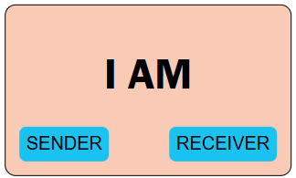
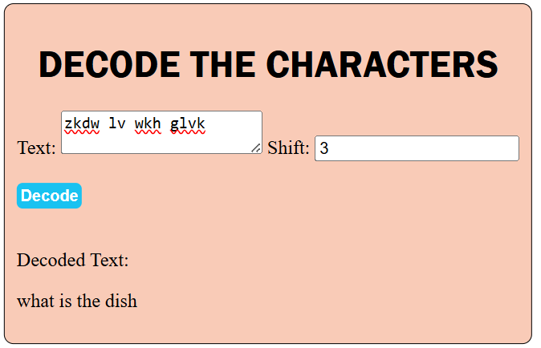
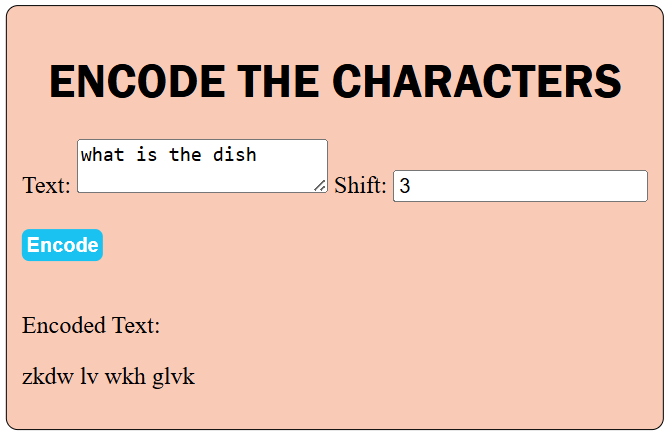

# Simple CRYPTOGRAPHER

Cryptography tools are software or platforms that use encryption and decryption techniques to protect data. They are essential for maintaining data security and privacy in various contexts, including online transactions, file storage, and communication. These tools ensure that sensitive information remains confidential and inaccessible to unauthorized individuals. 
## Screenshots
the main interface

the encoder interface

the decoder interface

